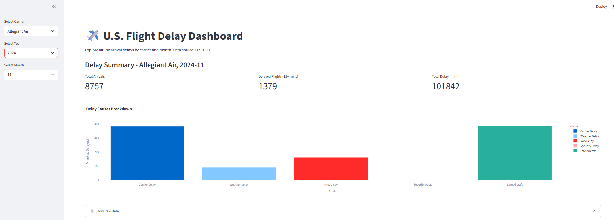

# ✈️ Flight Delay Dashboard

This interactive dashboard visualizes U.S. airline arrival delays by carrier and cause. It was built using Python, Streamlit, and Plotly, and is designed to explore operational performance patterns from aviation data.



## 📊 Features

- Filter by **airline**, **year**, and **month**
- View **key metrics**: total flights, delayed arrivals, total delay time
- Breakdown of **delay causes**: carrier, weather, NAS, security, late aircraft
- Toggle to view **raw data table**

> ✅ Built as part of a personal project to explore aviation operations and demonstrate domain interest in air transport technologies.

---

## 🧰 Tech Stack

- **Python 3.9+**
- [Streamlit](https://streamlit.io/) for app UI
- [Pandas](https://pandas.pydata.org/) for data processing
- [Plotly](https://plotly.com/python/) for visualizations
- Real-world data from [U.S. DOT Transtats](https://www.transtats.bts.gov/)

---

## 📁 Project Structure

```
flight-delay-dashboard/
├── app.py # Main dashboard app
├── data/
│ └── flight_delays.csv # Cleaned dataset
├── requirements.txt
├── .gitignore
└── README.md
```

---

## 🚀 Getting Started

### 1. Clone the Repo

```bash
git clone https://github.com/PFZM/flight-delay-dashboard.git
cd flight-delay-dashboard
```

### 2. Set Up Environment (Windows)

```bash
python -m venv venv
venv\Scripts\activate
pip install -r requirements.txt
```

### 3. Run the App

```bash
streamlit run app.py
```

Then open your browser to http://localhost:8501

## 📦 Dataset

This app uses U.S. DOT On-Time Performance data, grouped by month and carrier. Delay causes include:

Carrier Delay

Weather Delay

NAS Delay (National Airspace System)

Security Delay

Late Aircraft Delay

## 🛣️ Roadmap / Possible Extensions

Add airport-level filtering

Show delay trends over time (line charts)

Integrate with OpenSky or FAA API for real-time insights

Deploy on Streamlit Cloud

## 👤 Author

Pablo Zambrano
Cloud & Data Engineer pivoting into aviation tech 🚀
[LinkedIn →](https://www.linkedin.com/in/pablo-zambrano)

## 📄 License

This project is open-source under the MIT License.
